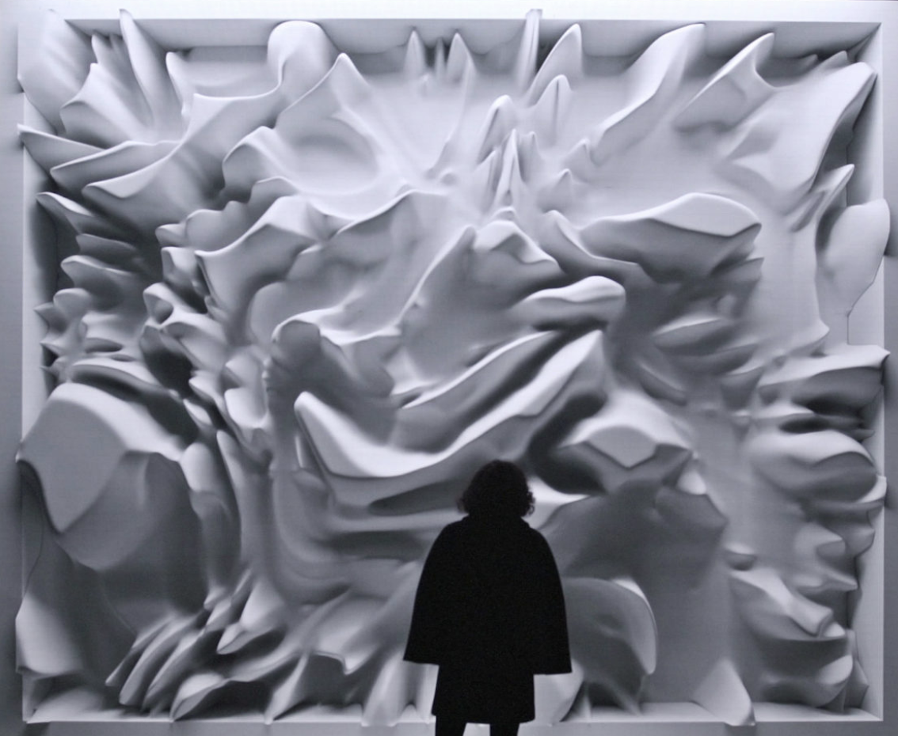

# Quiz 8

# Part 1: Imaging Technique Inspiration

**Example:** Refik Anadol — *Wind of Boston: Data Paintings*  
I am inspired by Refik Anadol’s “Wind of Boston,” where particle movements visualize invisible natural forces. I would like to incorporate a similar particle flow aesthetic into my project to represent emotion or sound as dynamic, abstract motion. This technique effectively combines minimal form with rich, evolving behavior, making the visual experience both calm and immersive. It fits my assignment’s goal of creating an interactive, responsive artwork that reacts to user input or environmental data, transforming intangible concepts into a living digital landscape.

# Part 2: Coding Technique Exploration

**Technique:** Perlin Noise Flow Field in p5.js  
The Perlin noise flow field is a popular coding technique for simulating natural, smooth movement patterns in generative art. In p5.js, it allows particles to follow invisible vector fields generated by noise functions, producing fluid, wind-like motion. This technique could help me recreate the aesthetic of Refik Anadol’s flowing particles in an accessible, real-time way. It provides both structure and randomness, giving the artwork organic movement while keeping it computationally simple. The effect is dynamic yet harmonious—perfect for visualizing natural or emotional processes.

Example image: [Perlin Flow Field Example](https://openprocessing.org/sketch/738530)

Example Code: [Perlin Noise Flow Field — The Coding Train](https://thecodingtrain.com/challenges/24-perlin-noise-flow-field)

I have attached the code within the website address below for reference only:

var inc = 0.1;
var scl = 10;
var cols, rows;

var zoff = 0;

var fr;

var particles = [];

var flowfield;

function setup() {
  createCanvas(600, 400);
  cols = floor(width / scl);
  rows = floor(height / scl);
  fr = createP('');

  flowfield = new Array(cols * rows);

  for (var i = 0; i < 300; i++) {
    particles[i] = new Particle();
  }
  background(51);
}

function draw() {
  var yoff = 0;
  for (var y = 0; y < rows; y++) {
    var xoff = 0;
    for (var x = 0; x < cols; x++) {
      var index = x + y * cols;
      var angle = noise(xoff, yoff, zoff) * TWO_PI * 4;
      var v = p5.Vector.fromAngle(angle);
      v.setMag(1);
      flowfield[index] = v;
      xoff += inc;
      stroke(0, 50);
      // push();
      // translate(x * scl, y * scl);
      // rotate(v.heading());
      // strokeWeight(1);
      // line(0, 0, scl, 0);
      // pop();
    }
    yoff += inc;

    zoff += 0.0003;
  }

  for (var i = 0; i < particles.length; i++) {
    particles[i].follow(flowfield);
    particles[i].update();
    particles[i].edges();
    particles[i].show();
  }

  // fr.html(floor(frameRate()));
}